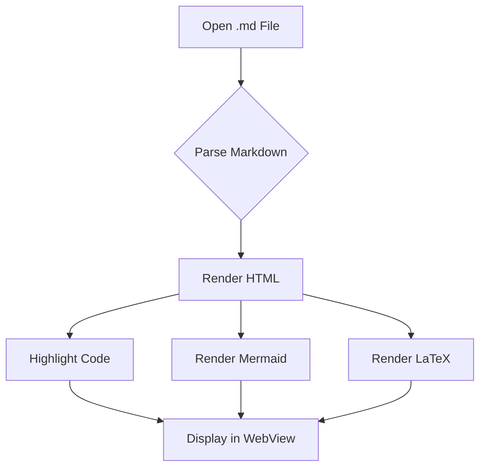
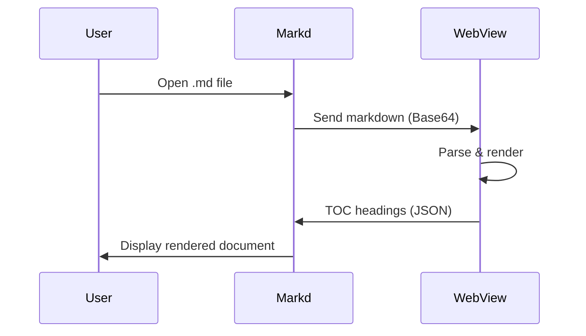

# Markd Sample Document

This is a sample markdown document to test **Markd**, a macOS markdown viewer.

## Text Formatting

You can use **bold**, _italic_, ~~strikethrough~~, and `inline code`.

Here's a [link to GitHub](https://github.com) and an auto-linked URL: https://example.com

## Code Blocks

```swift
import SwiftUI

struct ContentView: View {
    var body: some View {
        Text("Hello, Markd!")
            .font(.largeTitle)
            .padding()
    }
}
```

```python
def fibonacci(n):
    if n <= 1:
        return n
    return fibonacci(n - 1) + fibonacci(n - 2)

print([fibonacci(i) for i in range(10)])
```

## Tables

| Feature    | Status | Notes                  |
| ---------- | ------ | ---------------------- |
| GFM Tables | ✅     | Full support           |
| Task Lists | ✅     | Interactive checkboxes |
| Mermaid    | ✅     | Diagrams render inline |
| LaTeX      | ✅     | KaTeX engine           |
| Dark Mode  | ✅     | Follows system         |

## Task Lists

- [x] Set up project structure
- [x] Implement markdown rendering
- [x] Add TOC sidebar
- [ ] Add file watching
- [ ] Add PDF export

## Blockquotes

> "The best way to predict the future is to invent it."
> — Alan Kay

## Mermaid Diagrams





## LaTeX Math

Inline math: The quadratic formula is $x = \frac{-b \pm \sqrt{b^2 - 4ac}}{2a}$.

Display math:

$$
\int_{-\infty}^{\infty} e^{-x^2} dx = \sqrt{\pi}
$$

$$
\sum_{n=1}^{\infty} \frac{1}{n^2} = \frac{\pi^2}{6}
$$

## Images

Images with URLs will render if accessible:


## Nested Lists

1. First item
   - Sub-item A
   - Sub-item B
     - Deep nested
2. Second item
3. Third item

## Horizontal Rule

---

## Internal Links

Jump to [Text Formatting](#text-formatting) or [Mermaid Diagrams](#mermaid-diagrams).

## Final Section

That's it! Markd renders all of this natively on macOS with dark mode support. 🎉
